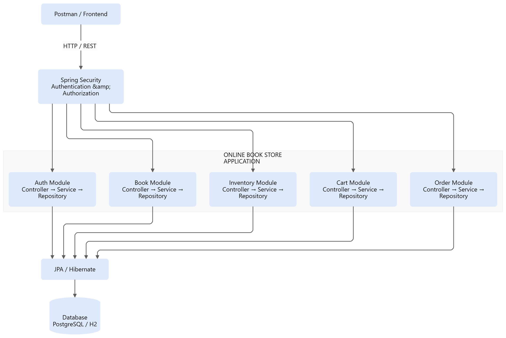

# Online Book Store API

A Spring Boot 4.x REST API for an online bookstore. The application is
implemented as a **modular monolith**: all business modules run in one
Spring Boot application and communicate through Java services/interfaces
rather than through network-based microservices.

## 1\. Technology Stack

* Java 17
* Spring Boot
* Spring Web
* Spring Data JPA / Hibernate
* Spring Security
* Bean Validation
* Lombok
* Relational database
* Maven
* Postman for API testing

## 2\. Architecture

The Online Book Store Application follows a modular monolith architecture.




### Why modular monolith?

This is **not a microservices application**.

All modules: - are deployed as one application - share the same
database - communicate through Java method/service calls - can be
separated into microservices later if required

## 3\. Main Modules

``` text
com.bookstore.onlinebookstore
│
├── auth
│   ├── controller
│   ├── dto
│   ├── entity
│   ├── repository
│   └── service
│
├── book
│   ├── controller
│   ├── dto
│   ├── entity
│   ├── repository
│   └── service
│
├── inventory
│   ├── controller
│   ├── dto
│   ├── entity
│   ├── repository
│   └── service
│
├── cart
│   ├── controller
│   ├── dto
│   ├── entity
│   ├── repository
│   └── service
│
├── order
│   ├── controller
│   ├── dto
│   ├── entity
│   ├── repository
│   └── service
│
├── security
│   └── SecurityConfig.java
│
└── exception
    ├── GlobalExceptionHandler.java
    ├── ErrorResponse.java
    ├── ValidationErrorResponse.java
    └── ResourceNotFoundException.java
```

## 4\. Module Responsibilities

### Auth

Responsible for: - user registration - password hashing - loading users
for Spring Security - role management

Roles: - `CUSTOMER` - `ADMIN`

### Book

Responsible for: - creating books - retrieving books - updating books -
deleting books

### Inventory

Responsible for: - maintaining stock for books - checking stock -
increasing/decreasing stock

Inventory management is restricted to administrators.

### Cart

Responsible for: - retrieving a customer's cart - adding books -
updating quantities - removing cart items - clearing the cart

### Order

Responsible for: - checkout - creating orders from the cart - creating
order items - calculating order totals - reducing inventory - clearing
the cart after successful order creation - retrieving orders

## 5\. Authentication and Authorization

The application uses **HTTP Basic Authentication**.

There is intentionally no separate login endpoint in the Basic
Authentication implementation.

A client sends:

``` http
Authorization: Basic <base64(username:password)>
```

with each protected request.

Postman should be configured as:

``` text
Authorization
Type: Basic Auth

Username: customer@gmail.com
Password: password123
```

Spring Security then:

``` text
HTTP Request
     │
     ▼
Spring Security Filter
     │
     ▼
CustomUserDetailsService
     │
     ▼
users table
     │
     ├── password → BCrypt verification
     │
     └── role
          │
          ▼
   SecurityContext
          │
          ▼
 Authorization Check
          │
     ┌────┴────┐
     ▼         ▼
   Allowed   Rejected
     │       401 / 403
     ▼
 Controller
```

### 401 vs 403

**401 Unauthorized**

Returned when authentication is missing or invalid.

Example:

``` text
GET /api/cart
(no Basic Auth)
→ 401 Unauthorized
```

**403 Forbidden**

Returned when the user is authenticated but does not have the required
role.

Example:

``` text
CUSTOMER
   ↓
GET /api/inventory/1
   ↓
Requires ADMIN
   ↓
403 Forbidden
```

## 6\. Role-Based Access

The application uses both URL-level authorization in `SecurityConfig`
and method-level authorization using `@PreAuthorize`.

Conceptually:

``` text
                    Request
                       │
                       ▼
              Spring Security
                       │
              Authentication
                       │
                       ▼
                 User Role
                       │
              ┌────────┴────────┐
              ▼                 ▼
          CUSTOMER            ADMIN
              │                 │
        Cart / Order       Inventory
                          Book management
```

Typical access rules:                     

| API Area                       | CUSTOMER | ADMIN |

|--------------------------------|:--------:|:-----:|

| Registration                   |   Yes    |  Yes  |

| Read books                     |   Yes    |  Yes  |

| Create / update / delete books |    No    |  Yes  |

| Cart                           |   Yes    |  No   |

| Orders                         |   Yes    |  No   |

| Inventory management           |    No    |  Yes  |

## 7\. Password Security

Passwords are never stored as plain text.

During registration:

``` text
Plain password
      │
      ▼
BCryptPasswordEncoder
      │
      ▼
BCrypt hash
      │
      ▼
Database
```

During authentication:

``` text
Password supplied by client
          │
          ▼
BCrypt password verification
          │
      ┌───┴───┐
      ▼       ▼
    Match   No match
      │       │
      ▼       ▼
   Allowed   401
```

## 8\. Database Relationship

Main relationships:

``` text
User
 │
 │ 1
 │
 │
 ▼
Cart
 │
 │ 1
 │
 │ \\\*
 ▼
CartItem
 │
 │ \\\*
 │
 ▼
Book


Book
 │
 │ 1
 │
 │ \\\*
 ▼
Inventory


User
 │
 │ 1
 │
 │ \\\*
 ▼
Order
 │
 │ 1
 │
 │ \\\*
 ▼
OrderItem
 │
 │ \\\*
 │
 ▼
Book
```

`CartItem` contains a `bookId`, and `OrderItem` contains the book
reference needed for the order.

The `Cart` → `CartItem` relationship is modeled as a bidirectional JPA
relationship:

``` java
@OneToMany(
    mappedBy = "cart",
    cascade = CascadeType.ALL,
    orphanRemoval = true
)
private List<CartItem> items;
```

`CartItem` owns the database relationship:

``` java
@ManyToOne(fetch = FetchType.LAZY)
@JoinColumn(name = "cart\\\_id")
private Cart cart;
```

## 9\. Complete Business Flow

The normal customer journey is:

``` text
1. Register
      │
      ▼
2. Authenticate using Basic Auth
      │
      ▼
3. Browse books
      │
      ▼
4. Add book to cart
      │
      ▼
5. View/update cart
      │
      ▼
6. Checkout / create order
      │
      ├── Read cart
      ├── Validate cart
      ├── Check inventory
      ├── Reduce inventory
      ├── Create order
      ├── Create order items
      ├── Calculate total
      └── Clear cart
      │
      ▼
7. Order summary
```

## 10\. Checkout Flow

``` text
                 POST /api/orders
                        │
                        ▼
                 OrderController
                        │
                        ▼
                   OrderService
                        │
              ┌─────────┴─────────┐
              ▼                   ▼
          CartService        InventoryService
              │                   │
              ▼                   ▼
         Cart + Items        Stock validation
              │                   │
              └─────────┬─────────┘
                        ▼
                  Create Order
                        │
                        ▼
                 Save Order/Items
                        │
                        ▼
                  Clear Cart
                        │
                        ▼
                  OrderResponse
```

There is no Payment Service in this implementation because the
requirement is a simple checkout/order-summary flow. A payment module
can be added later if payment processing is required.

## 11\. Running the Application

### Prerequisites

Install:

* Java 17
* Maven
* Database configured in `application.properties` / `application.yml`
* Git
* Postman

Verify Java:

``` bash
java -version
```

The project requires Java 17.

Verify Maven:

``` bash
mvn -version
```

### Configure database

Update the project's database configuration, for example:

The application is already configured with an \*\*H2 in-memory database\*\*, so no external database setup is required for local testing.


Simply start the Spring Boot application. The required database schema and tables will be created automatically based on the JPA entities.


\### View H2 Database


To view the database schema, tables, and data, open:


``` text

http://localhost:8080/h2-console

```

### Build

``` bash
mvn clean install
```

### Run

``` bash
mvn spring-boot:run
```

Or run the main Spring Boot class from Eclipse:

``` text
Run As → Spring Boot App
```

Default URL:

``` text
http://localhost:8080
```

If a different port is configured, replace `8080` in the examples below.

## 12\. Postman Test - Complete Demo Order

The following sequence creates one complete order.

### Step 1 - Register a customer

``` http
POST http://localhost:8080/api/auth/register
Content-Type: application/json
```

Postman:

``` text
Authorization → No Auth
Body → raw → JSON
```

Body:

``` json
{
  "email": "customer@gmail.com",
  "password": "password123"
}
```

Expected:

``` json
{
  "id": 1,
  "email": "customer@gmail.com",
  "role": "CUSTOMER"
}
```

Save the returned user ID if needed for debugging.

### Step 2 - Create an ADMIN user

Normal registration must not allow the client to select `ADMIN`, because
that would allow anyone to create an administrator account.

A default administrator account is automatically created when the application starts, \*\*only if no ADMIN user already exists\*\* in the database.


Use the following credentials for admin-level API testing:


``` text

Username: admin@onlinebookstore.com

Password: admin123

Role:     ADMIN

```

### Step 3 - Create a book as ADMIN

Use Postman:

``` text
Authorization → Basic Auth

Username: admin@onlinebookstore.com
Password: admin123
```

Then call the Book create endpoint implemented by the repository, for
example:

``` http
POST http://localhost:8080/api/books
Content-Type: application/json
```

Example body:

``` json
{
  "title": "Clean Code",
  "author": "Robert C. Martin",
  "price": 550.00
}
```

Expected result should contain a generated book ID.

Assume:

``` text
bookId = 1
```

If the generated ID is different, use the returned ID in all following
requests.

### Step 4 - Add inventory as ADMIN

``` http
POST http://localhost:8080/api/inventory
Content-Type: application/json
Authorization: Basic <ADMIN credentials>
```

Example:

``` json
{
  "bookId": 1,
  "quantity": 10
}
```

Result:

``` text
Book 1
Stock = 10
```

### Step 5 - Add the book to the customer's cart

Change Postman's Basic Auth:

``` text
Username: customer@gmail.com
Password: password123
```

Then:

``` http
POST http://localhost:8080/api/cart/items
Content-Type: application/json
```

Body:

``` json
{
  "bookId": 1,
  "quantity": 2
}
```

The customer now has:

``` text
Clean Code × 2
```

### Step 6 - Verify the cart

``` http
GET http://localhost:8080/api/cart
```

Expected logical result:

``` json
{
  "cartId": 1,
  "items": \\\[
    {
      "bookId": 1,
      "title": "Clean Code",
      "price": 550.00,
      "quantity": 2,
      "subtotal": 1100.00
    }
  ],
  "totalAmount": 1100.00
}
```

### Step 7 - Verify inventory before checkout

Switch to ADMIN credentials:

``` http
GET http://localhost:8080/api/inventory/1
```

Expected:

``` text
quantity = 10
```

### Step 8 - Place the order

Switch back to CUSTOMER credentials.

``` http
POST http://localhost:8080/api/orders
```

No request body is required if the implementation derives the order from
the authenticated customer's cart.

The Order Service should:

``` text
Cart
 └── Clean Code × 2
          │
          ▼
Inventory
 └── 10 → 8
          │
          ▼
Order
 └── Clean Code × 2
          │
          ▼
Total = ₹1100
          │
          ▼
Cart items removed
```

Expected logical response:

``` json
{
  "orderId": 1,
  "userId": 1,
  "status": "PLACED",
  "totalAmount": 1100.00,
  "items": \\\[
    {
      "bookId": 1,
      "bookTitle": "Clean Code",
      "price": 550.00,
      "quantity": 2,
      "subtotal": 1100.00
    }
  ]
}
```

### Step 9 - Verify inventory after checkout

Switch to ADMIN credentials:

``` http
GET http://localhost:8080/api/inventory/1
```

Expected:

``` text
Before checkout: 10
Ordered:          2
After checkout:   8
```

### Step 10 - Verify cart is empty

Switch to CUSTOMER credentials:

``` http
GET http://localhost:8080/api/cart
```

Expected:

``` json
{
  "items": \\\[],
  "totalAmount": 0
}
```

The cart record can remain in the database; its cart items are removed.

### Step 11 - Get the order

``` http
GET http://localhost:8080/api/orders/1
```

Use the actual `orderId` returned by the checkout request.

Expected status:

``` text
PLACED
```

## 13\. Complete Postman Sequence

``` text
CUSTOMER
   │
   └── POST /api/auth/register
             │
             ▼
ADMIN
   │
   ├── POST /api/books
   │
   └── POST /api/inventory
             │
             ▼
CUSTOMER
   │
   ├── POST /api/cart/items
   │
   ├── GET  /api/cart
   │
   └── POST /api/orders
             │
             ▼
ADMIN
   │
   └── GET /api/inventory/{bookId}
             │
             ▼
CUSTOMER
   │
   ├── GET /api/cart
   │
   └── GET /api/orders/{orderId}
```

## 14\. API Summary

### Authentication

Method   Endpoint               Access

\---

POST     `/api/auth/register`   Public

### Books

The Book module exposes the CRUD endpoints implemented in the
repository.

Typical operations:

Method   Endpoint            Access

\---

GET      `/api/books`        CUSTOMER / ADMIN
GET      `/api/books/{id}`   CUSTOMER / ADMIN
POST     `/api/books`        ADMIN
PUT      `/api/books/{id}`   ADMIN
DELETE   `/api/books/{id}`   ADMIN

### Inventory

Method   Endpoint                    Access

\---

GET      `/api/inventory/{bookId}`   ADMIN
POST     `/api/inventory`            ADMIN
PUT      `/api/inventory/{bookId}`   ADMIN

Use the exact endpoint mappings present in the repository if they
differ.

### Cart

Method   Endpoint                     Access

\---

GET      `/api/cart`                  CUSTOMER
POST     `/api/cart/items`            CUSTOMER
PUT      `/api/cart/items/{bookId}`   CUSTOMER
DELETE   `/api/cart/items/{bookId}`   CUSTOMER
DELETE   `/api/cart`                  CUSTOMER

### Orders

Method   Endpoint                  Access

\---

POST     `/api/orders`             CUSTOMER
GET      `/api/orders/{orderId}`   CUSTOMER
GET      `/api/orders`             CUSTOMER

The exact Order endpoints should match the controller mappings in the
repository.

## 15\. Error Handling

The application uses centralized exception handling.

Typical responses:

### Resource not found

``` json
{
  "status": 404,
  "message": "Book not found"
}
```

### Validation error

For invalid request data, the validation handler returns a structured
validation response containing the failed fields/messages.

Example:

``` json
{
  "status": 400,
  "message": "Validation failed",
  "errors": {
    "email": "Invalid email",
    "password": "Password must contain at least 6 characters"
  }
}
```

### Authentication failure

``` text
401 Unauthorized
```

### Authorization failure

``` text
403 Forbidden
```

The exact JSON fields depend on the `ErrorResponse` and
`ValidationErrorResponse` classes in the repository.

## 16\. Transaction Management

Business operations that modify multiple records use transactions.

Example checkout:

``` text
@Transactional
       │
       ├── Read cart
       ├── Validate inventory
       ├── Reduce inventory
       ├── Save order
       ├── Save order items
       └── Clear cart
```

If a failure occurs during the transaction, the database changes can be
rolled back according to the transaction configuration.

Read-only operations use:

``` java
@Transactional(readOnly = true)
```

where appropriate.

## 17\. Java 17 Usage

The project uses Java 17 features where they improve readability.

### Records

DTOs are implemented using records where appropriate:

``` java
public record AddCartItemRequest(
        Long bookId,
        Integer quantity
) {}
```

Benefits: - immutable DTO structure - less boilerplate - generated
constructor/accessors - clear API models

### Local variable type inference

Where the type is obvious:

``` java
var cart = cartRepository.findByUserId(userId);
```

`var` is still statically typed; it does not make Java dynamically
typed.

### Stream `toList()`

Java 17 allows:

``` java
var items = cart.getItems()
        .stream()
        .map(...)
        .toList();
```

instead of the older collector form.

## 18\. Important Design Decisions

### No Payment Module

Payment processing is outside the current scope. Checkout creates an
order and returns an order summary.

### No Microservices

The modules are inside one Spring Boot application.

``` text
ONE APPLICATION
    ├── Auth
    ├── Book
    ├── Inventory
    ├── Cart
    └── Order
```

This avoids unnecessary network communication for the current scope.

```

## 19\. Recommended Testing Order

For a fresh database, test in this order:

``` text
1. Start database
2. Start Spring Boot application
3. Register CUSTOMER
4. Create/seed ADMIN
5. Login/authenticate through Basic Auth
6. Create BOOK as ADMIN
7. Create INVENTORY as ADMIN
8. Add BOOK to CART as CUSTOMER
9. Verify CART
10. Verify INVENTORY
11. Create ORDER
12. Verify ORDER
13. Verify INVENTORY decreased
14. Verify CART cleared
```

## 20\. Expected Final State After Demo

If the customer ordered 2 copies from an initial stock of 10:

``` text
Book
 └── Clean Code
       └── Price = ₹550

Inventory
 └── Before = 10
 └── After  = 8

Cart
 └── Empty

Order
 ├── Status = PLACED
 ├── Quantity = 2
 ├── Unit Price = ₹550
 └── Total = ₹1100
```

## 21\. Project Goal

The project demonstrates a clean Spring Boot backend with:

* modular package organization
* REST APIs
* JPA entity relationships
* DTO-based API contracts
* Java 17 features
* validation
* centralized exception handling
* transaction management
* Spring Security
* Basic Authentication
* role-based authorization
* book management
* inventory management
* shopping cart
* checkout/order processing

``` text
README
  ↓
Run application
  ↓
Register customer
  ↓
Create admin/seed admin
  ↓
Create book
  ↓
Create inventory
  ↓
Add to cart
  ↓
Checkout
  ↓
Verify order + inventory + cart
```


